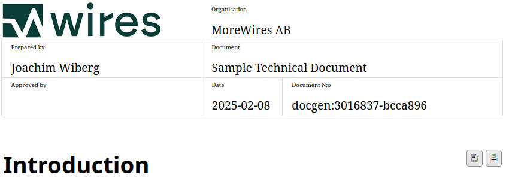

Technical Documents from Markdown
=================================

<!-- markdown-toc start - Don't edit this section. Run M-x markdown-toc-refresh-toc -->
**Table of Contents**

- [Technical Documents from Markdown](#technical-documents-from-markdown)
    - [Introduction](#introduction)
    - [Structure](#structure)
    - [Frontmatter](#frontmatter)
    - [Requirements](#requirements)
        - [Debian/Ubuntu Based Systems](#debianubuntu-based-systems)
    - [ToDo](#todo)

<!-- markdown-toc end -->

Introduction
------------

This document system for generating PDF and HTML files from [Markdown][]
text is based on [Pandoc][].  Inspiration for the templates comes from a
LaTeX package created back in 2001, called [technics.sty][].

Wires have released this project as *Open Source* to invite other users
in need of a similar framework to share and further improve on the
founding ideas.

[Pandoc]:       https://pandoc.org/
[Markdown]:     https://daringfireball.net/projects/markdown/syntax
[technics.sty]: https://www.ctan.org/tex-archive/macros/latex/contrib/technics


Examples
--------

**First the HTML version:**



**Next the PDF version:**


Notice how the HTML version has two click buttons on the right-hand side
just below the header.  One for opening the PDF version (better for
print) and one for opening the HTML print preview in your browser.  Be
aware that CSS `media print` still is very broken in most browsers.  Any
help improving `templates/addiva.html` CSS to be able to handle or trick
browsers better, is most welcome!


Usage
-----

 1. Fork or clone the repository, then jump to section Structure
 2. Set up `docgen.git` as a GIT submodule.  E.g., if your project has a
    subdirectory `doc/`:

	    cd doc/
		git submodule add git@github.com:addiva-elektronik/docgen.git
		ln -s docgen/Makefile .

That's it.  Provided you have read the Requirements section, you can
type `make` and then find your generated documents in the `output/`
sub-directory.

> **Note:** the `docgen/` sub-directory will be skipped by docgen, only
> actual substructures in your projects `doc/` directory (with `.md`
> files) will be used.


Structure
---------

Documents go in their own subdirectory, nesting subdirectories is not
supported.  Each subdirectory from the top level can have multiple
Markdown files.  For each Markdown file (`.md` suffix only) the Makefile
generates a HTML and PDF version in the `output/` subdirectory using
[pandoc](https://pandoc.org/).

    docgen/
     |-- foo/
     |    |-- concepts.md
     |    `-- memo-2022-09-12.md
     |-- bar/
     |    |-- concepts.md
     |    `-- memo-2022-08-01.md
     |-- output/
     |    |-- foo/
     |    |    |-- concepts.html
     |    |    |-- concepts.pdf
     |    |    |-- memo-2022-09-12.html
     |    |    `-- memo-2022-09-12.pdf
     |    `-- bar/
     |          |-- concepts.html
     |          |-- concepts.pdf
     |          |-- memo-2022-08-01.html
     |          `-- memo-2022-08-01.pdf
     |-- templates/
     |    |-- addiva.html
     |    `-- addiva.pdf
     |-- Makefile
     `-- server.sh

Currently two templates, for HTML and PDF generation, are available, but
more could be added.  For example `.docx` and slideshows in reveal.js.


Frontmatter
-----------

Standard [Pandoc variables](https://pandoc.org/MANUAL.html#variables)
are supported in the (optional) Yaml frontmatter.  However, to enable
the Addiva specific document header variants a couple of extra variables
have been addded.  These are described in this section.

Here is an example of a YAML frontmatter, which goes at the very top of
the document.  *Most relevant options* are under `document:`, the rest
can be omitted completely.

Notice the starting and closing `---` of the frontmatter:

```yaml
---
document:
  name: Sample Technical Document
  prepared: Joachim Wiberg
  organisation: Addiva Elektronik AB
  approved:
copyright:
  holder: Addiva Elektronik AB
numbersections: true
classoption: twoside
fontsize: 11pt
mainfont: SourceSerifPro-Regular.otf
mainfontoptions: Numbers=OldStyle
sansfont: SourceSansPro-Regular.otf
sansfontoptions: Numbers=OldStyle
monofont: SourceCodePro-Regular.otf
monofontoptions: Scale=0.75
---
```

 * `document:` enables the document header
   * `name:` sets the `Document name` field
   * `prepared:` sets the `Prepared by` field
   * `approved:` sets the `Approved by` field, if unset PDF documents
     will have a **DRAFT** watermark applied
   * `organisation:` enables the optional `Organisation` field right of
     the logo
   * `number`: sets `Document No` field, defaults to an automatically
     generated string composed from the GIT *repository name*, the
     source file's *object hash* and last change *GIT revision* of
     the file: `name:object-revision`.  Note: the `-revision` part
	 is *always* added to the document number.
 * `copyright:` enables a copyright footer (type custom text here), or
   fall back to the default by setting either of the following options:
   * `year:` sets the optional copyright years field, e.g., "2021-2022",
     default: automatically sets current year
   * `holder`: defaults to the organisation (above), or "Addiva
     Elektronik AB" if organisation is unset
 * `numbersections`: optional, if set to `true` the PDF will used
   numbered sections (this is what most readers expect)
 * `classoption`: optional, used for PDF generation (LaTeX class option)
 * `fontsize:` optional
 * `*font:` optional, the xelatex pandoc options are used with fallback
   to the Adobe Source{Sans,Serif,Code}-Regular.otf family
 * `*fontoptions:` optional, needs the corresponding `*font:` option to
   be set to take effect.  Default is `Numbers=OldStyle` for Sans and
   Serif fonts, and `Scale=0.0` for the monofont

> **Note:** the `classoption`, includes, and font variables are for the
> PDF generation (via LaTeX).  Also, only PDF document support the DRAFT
> stamp.


Requirements
------------

### Debian/Ubuntu Based Systems

    sudo apt install build-essential git
    sudo apt install pandoc texlive texlive-latex-extra texlive-fonts-extra texlive-font-utils

